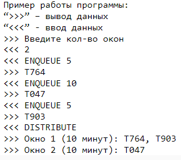
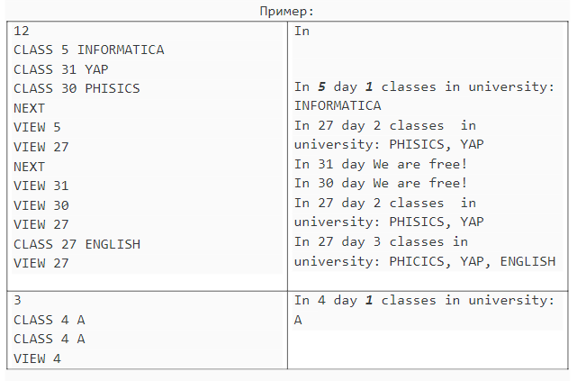

# Многофайловые проекты. Стандартная библиотека шаблонов.

**Цели и задачи работы:** программирование и отладка программ формирования и обработки контейнеров, комбинации контейнеров. 
**Задание к работе:** Написать программу решения задачи в соответствии с индивидуальным вариантом.

>Так как я нахожусь в журнале под номером 19, то и все мои варианты заданий являются остатком от деления на 19 (для 5.1 - 9 вариант, 5.2 - у всех один вариант, 5.3 - 3 вариант, 5.4 - 3 вариант).

## "Учет товаров на складе."

Реализовать программу для учета товаров на складе. Все ячейки  на складе имеют свои адреса (например А1739), адрес состоит из следующих обозначений: 
1) А, Б, В - зона хранения - теплый, холодный склад или часть склада; 
2) 17 - порядковый номер стеллажа; 
3) 3 - порядковый номер вертикальной секции стеллажа; 
4) 9 - порядковый номер полки. 

В каждую ячейку помещается не более 10 единиц товара. Программа должна позволять добавлять товары в ячейки, просматривать состояние склада, убирать товар из ячейки. 

* Для добавления в ячейку будет использоваться команда: **ADD**/**add** в виде: **ADD <наименование товара> <количество> <адрес ячейки>**. В случае, если товаров больше 10, то вывести: "Количество товара больше 10, он не поместиться в ячеку"
* Для удаления товара из ячейки использовать команду: **REMOVE**/**remove** в виде: **REMOVE <наименование товара> <количество> <адрес ячейки>**. Если товара меньше количесва, которое хочет удалить пользователь, то вывести уведомление: "На складе недостаточно товара (сейчас в данной ячейке содержитья: <актуальное число товара>)".
* Для получения информации о состоянии склада использовать команду: **INFO**/**info**. Команда выведет на сколько процентов загружен склад, на сколько процентов загружен каждая зона склада, а также выводит содержимое каждой ячейки, если там есть хотя бы отдна единица товара.

## "Электронная очередь."

На вход в программу подается кол-во окон способных обрабатывать очередь посетителей. Далее с помощью команды **ENQUEUE** добавляются в очередь, команда принимает продолжительность посещения и выдает номер талона. После того как введено нужное количество посетителей вводиться команда **DISTRIBUTE**. Программа должна вывести распределение очереди посетителей на все окна, распределение должно быть такое, чтобы обработать очередь максимально быстро.

## "График движения самолетов"

* Реализовать многофайловый проект, предусматривающий обработку запросов:

1) **CREATE_PLANE plane town1 town2 town3 ... townN** - Создание самолета с именем **plane**, который пролетает через города **town1, town2, town3, ..., townN**
2) **PLANES_FOR_TOWN town** - Вывод всех самолетов пролетающих через город **town**
3) **TOWNS_FOR_PLANE plain** - Вывод всех городов, которые пролетает самолет с именем **plane**. Для каждого города прописать, какие самолеты делают остановку в этом городе (не включаю **plain**)
4) **PLANES** - Отобразить все самолеты с указанием городов-остановок

## "Комбинация контейнеров"

* У каждого студента есть рассписание занятий. осещать занятия необходимо в конкретный день определенного месяца. Необходимо автоматизировать работу расписания за счет обработки операций:

_______________________________________________________________
|   Запрос  |         Расшифровка       |       Output        |
|-----------|---------------------------|---------------------|
|           | Установить дисциплину     |                     |
| CLASS i s | s в день i текущего       |        ----         |
|           | месяца                    |                     |
|-----------|---------------------------|---------------------|
|           |                           |                     |
|   NEXT    | Смена месяца на следующий |        ----         |
|           |                           |                     |
|-----------|---------------------------|---------------------|
|           | Организовать вывод всех   | In i day N classes  |
|           | дня i. При отсутствии пар | in university:      |
|  VIEW i   | - выдать соответствующее  | class 1,...,class N.|
|           |        сообщение          | In i day We are     |
|           |                           | free!               |
|___________|___________________________|_____________________|

